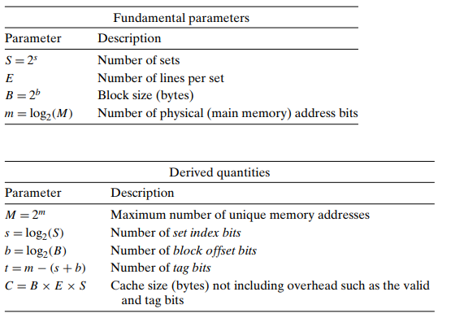
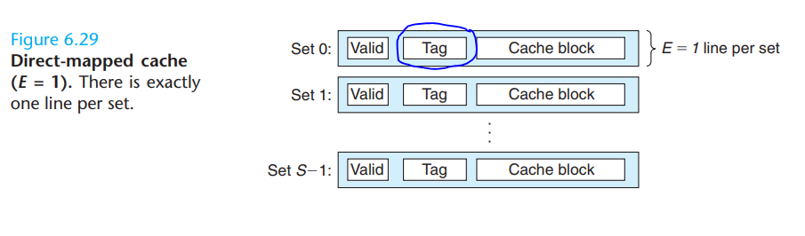
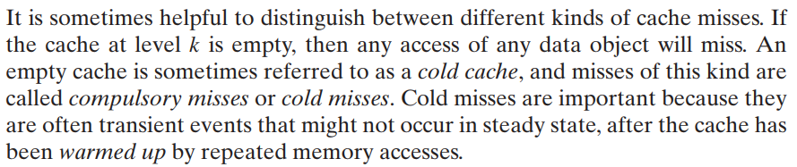

## 1 zad

## 2 zad

#### Może się przydać:
<a name = "wzorki"></a>




| Informacja                | Rozmiar
|    -------                | ---
| Szerokość szyny adresowej | 12 
| Zbiory                    | 2  
| Rozmiar bloku             | 4  

Dalej:

```
S = 2^s
S = 4 => s = 2
```
```
B = 2^b
B = 4 => b = 2
```
```
m = 12
t = 12 - (2 + 2) = 8
```

| Adres<sub>(16)</sub> | Adres<sub>(2)</sub> | Trafienie?    | Wartość
| ----  | ----------------- |   ------      | ----
|       | tttt tttt ssbb    |               |
| 832   | 1000 0012 0010    |    Tak        | CC D0
| 835   | 1000 0012 0101    |    Nie        |   
| FFD   | 1111 1111 1101    |    Tak        | C0 03

## 3 zad

Przydatne [wzorki](#wzorki) były wyżej
```
(tag, index, offset) = (22, 5, 5)
ad1. Rozmiar bloku = 2^b = 2^5B
ad2. Liczba wierszy = 2^s = 2^5 = 32
```
```
ad3. 
    Metadane => 32 * (1 bit valid + 22 tag bits) = 736b
    Dane     => 32 * (32 Bajtów)                 = 8192b
    Stosunek => 8192/736                         = 11.3
```

## 4 zad

<a name = "4zadD"></a>
`Tylko jeden tag w secie!`

`Cold cache miss`

`conflict miss`

`capacity miss`

| Adres<sub>(10)</sub>| Adres<sub>(2)</sub> | (tag<sub>22</sub>, index<sub>5</sub>, offset<sub>5</sub>)  | Trafione? 
| ------------------|-------------------:|:----------------------:|----------
| 0                 | 0                 | (0, 0, 0)                 | compulsory miss
| 4                 | 100               | (0, 0, 100)               | **hit!**
| 16                | 1000              | (0, 0, 1000)              | **hit!**
| 132               | 100 00100         | (0, 100, 00100)           | compulsory miss
| 232               | 111 01000         | (0, 111, 01000)           | compulsory miss
| 160               | 101 00000         | ...                       | compulsory miss
| 1024              | 1 00000 00000     | | conflict miss  
| 28                | 11100             | | conflict miss  (musimy nadpisać już istniejące)
| 140               | 100 01100         | |  **hit!**
| 3100              | 11 00000 11100    | | conflict miss 
| 180               | 101 10100         | | **hit!**
| 2180              | 10 00100 00100    | | conflict miss 

```
na końcu:
    (0, 111, ...) (0,101, ...)
    (11, 0, ...) (10, 100, ...)
```
```
 Efektywność    = 4/12 => 33.(3)%
 Zastąpionych   = 4
```
## 5 zad

`Co to w pełni asocjacyjny cache?`

`Ad.1`
```
B = 2
b = 1
```
```
(Jeśli dobrze rozumiem)

Mamy 24 bloki i sekcyjno-skojarzeniową 3-drożną pamięć czyli, 3 bloki na 1 set => 8 setów

S = 8
s = 3
```
| Adres<sub>(10)</sub>| Adres<sub>(2)</sub> | (tag<sub>28</sub>, index<sub>3</sub>, offset<sub>1</sub>)  | Trafione? 
| ------------------|------------------:|:----------------------:|----------
| 0                 | 000 0              | (0, 000, 0)                 | compulsory miss
| 4                 | 010 0              | (0, 010, 0)               |  compulsory miss
| 16                | 100 0             | (0, 100, 0)              |  compulsory miss
| 132               | 1000 010 0        | (1000, 010, 0)           | compulsory miss
| 232               | 1110 100 0        | (1110, 100, 0)           | compulsory miss
| 160               | 1010 000 0        | ...                       | compulsory miss
| 1024              | 1000000 000 0     | | compulsory miss
| 28                | 1 110 0           | | compulsory miss
| 140               | 1000 110 0        | | compulsory miss
| 3100              | 11000001 110 0    | | compulsory miss
| 180               | 1011 010 0        | | compulsory miss
| 2180              | 10001000 010 0    | | conflict miss (zastępujemy 4 adres)

```
na końcu:
    (10001000,  010, ...)
    (1000,      010, ...)
    (1011,      010, 0)
```
```
 Efektywność    = 0/12 => 0%
 Zastąpionych   = 1
```

`Ad.2`
```
B = 1
b = 0
```
```
Mamy 8 bloków i w pełni asocjacyjny cache :=>
S = 1
s = 0
```
| Adres<sub>(10)</sub>| Adres<sub>(2)</sub> | (tag<sub>32</sub>, index<sub>0</sub>, offset<sub>0</sub>)  | Trafione? 
| ------------------|------------------:|:----------------------:|----------
| 0                 | 0000              | (0, 0, 0)                 | compulsory miss
| 4                 | 0100              | (100, 0, 0)               |  compulsory miss
| 16                | 1000             | (1000, 0, 0)              |  compulsory miss
| 132               | 10000100        | (10000100, 0, 0)           | compulsory miss
| 232               | 11101000        | (11101000, 0, 0)           | compulsory miss
| 160               | 10100000        | ...                       | compulsory miss
| 1024              | 10000000000     | | compulsory miss
| 28                | 11100           | | compulsory miss
| 140               | 10001100        | | capacity miss (zastępujemy 1 adres)
| 3100              | 110000011100    | | capacity miss (zastępujemy 2 adres)
| 180               | 10110100        | | capacity miss (zastępujemy 3 adres)
| 2180              | 100010000100    | | capacity miss (zastępujemy 4 adres)

```
na końcu:
    (11101000,      ...)
    (10100000,      ...)
    (10000000000,   ...)
    ...
```
```
 Efektywność    = 0/12 => 0%
 Zastąpionych   = 4
```
## 6 zad

## 7 zad


Ad 1.
- L1 `0.66ns + 8/100 * 70ns = 6.26ns`
- L2 `0.66ns + 8/100 * (5.62ns + 0,5% * 70ns) = 1.137ns`

Ad 2.
- `1c + 36/100 * 6.26ns * 1c/0.66ns = 4.41`
- `1c + 36/100 * 1.137ns * 1c/0.66ns = 1.62`

## 8 zad

## 9 zad
