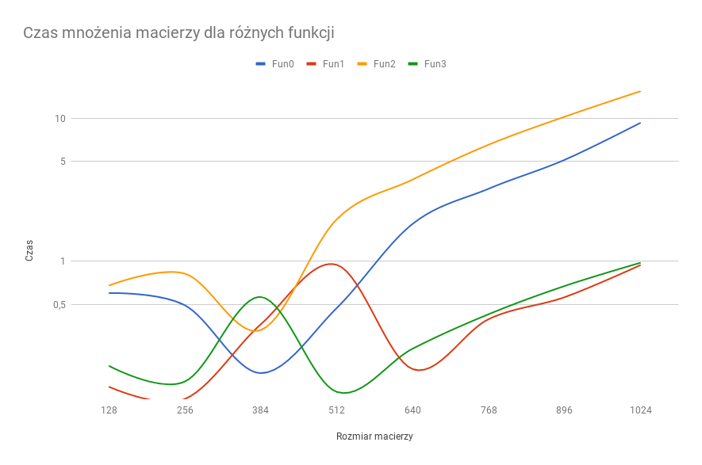
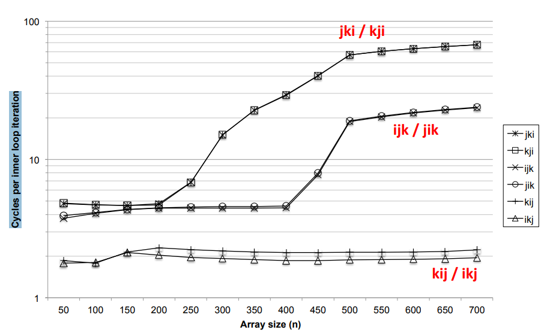
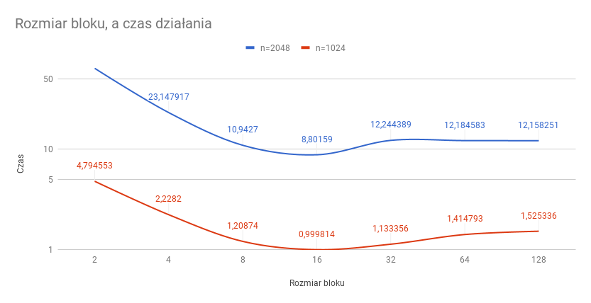
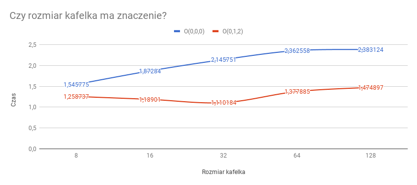
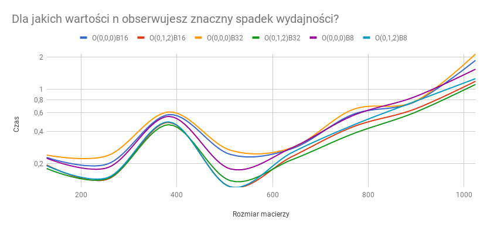
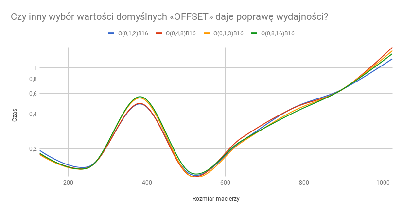
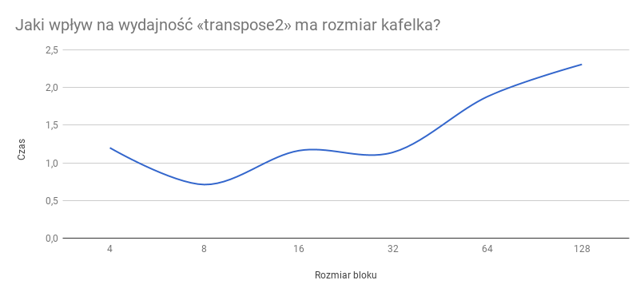
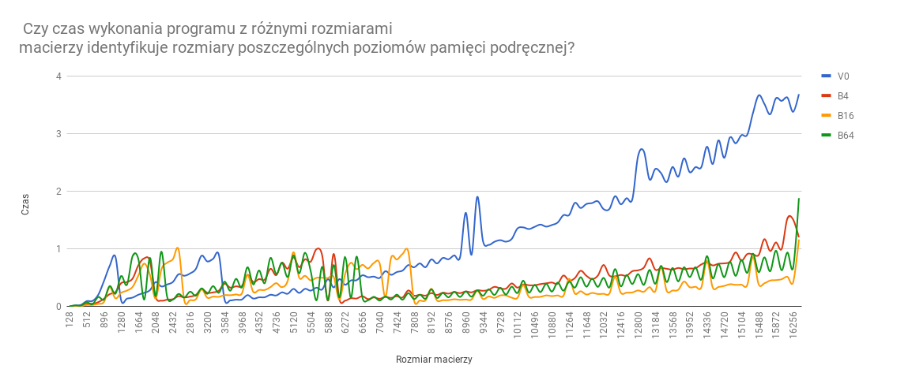
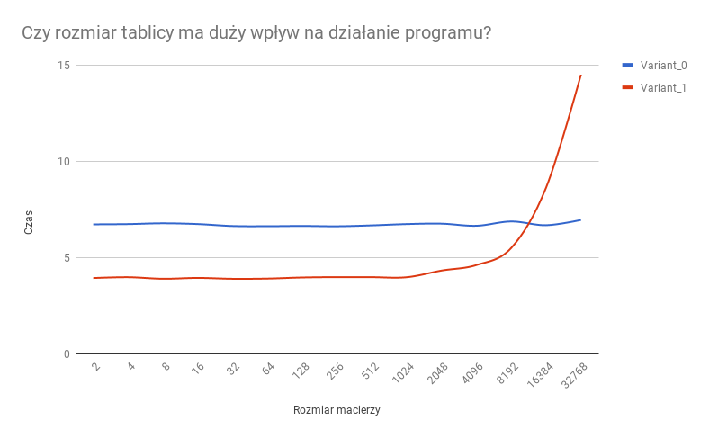

# Raport do zadań z pracowni #2

### Autor: Daniel Dubiel
### Numer indeksu: 291111

Konfiguracja
---

Informacje o systemie:

 * Dystrybucja: Linux Mint 18.3 Cinnamon 64-bit
 * Jądro systemu: 4.13.0-36-generic
 * Kompilator: GCC 5.4.0
 * Procesor: Intel(R) Core(TM) i5-3570K CPU @ 3.40GHz
 * Liczba rdzeni: 4

Pamięć podręczna:

 * L1d: 32 KiB, 8-drożny (per rdzeń), rozmiar linii 64B
 * L2: 256 KiB, 8-drożny (per rdzeń), rozmiar linii 64B
 * L3: 6MiB, 12-drożny (współdzielony), rozmiar linii 64B

Pamięć TLB:

 * L1d: 4KiB strony, 4-drożny, 64 wpisy
 * L2: 4KiB strony, 4-drożny, 512 wpisów

Informacje o pamięciach podręcznych uzyskano na podstawie wydruku programu
`hardinfo` (program `x86info` mi nie zadziałał).

Uwaga na skalę logarytmiczną na wykresach!
Jak powtórzyć testy? W makefile dodałem instrukcje generujące dane dla każdego zadania

Foldery zawierają dane do zadań, nie usuwałem bo bardzo długo się generują.

Arkusze Excel

https://docs.google.com/spreadsheets/d/1w6Zq49g7euxmctYjXcXD_wc0AzeQjdaybuI6294ez-k/edit?usp=sharing
https://docs.google.com/spreadsheets/d/17j4o7w1Ia-ebNx0I_ulOYxahzpzcdfPOLagiAl4FN-0/edit?usp=sharing
https://docs.google.com/spreadsheets/d/12cmpxKmVAaZ_UVEJRx9kjveNw1qlXbHx1v41cTiVniU/edit?usp=sharing
https://docs.google.com/spreadsheets/d/1Oeh1KsjyYrB4JeXsqqJ4myBgC8VhOJZos1BGF6otETQ/edit?usp=sharing

Zadanie 1
---

`Czy uzyskane wyniki różnią się od tych uzyskanych na slajdzie? `
Tak, mój wykres wydaje się dużo bardziej "niestabliny", dodatkowo wyniki uzyskane na slajdzie trwają dużo więcej czasu. Warto jednak zauważyć, że funkcje "trzymają się" parami na obu wykresach.

`Z czego wynika rozbieżność między wynikami dla poszczególnych wersji mnożenia macierzy?`
Rozbieżność wynika z różnych kolejność (dla każdej z funkcji) pobierania danych z pamięci.
Najszybsze funkcje starają się czytać jak najwięcej danych bez generowania miss'ów w cachu.

`Jaki wpływ ma rozmiar kafelka na wydajność «multiply3»?`
Wydajność jest największa jeśli rozmiar kafelka to 16. Dla pozostałych wartości możemy obserwować wzrost czasu mnożenia.

Zadanie 2
---

`Czy rozmiar kafelka ma znaczenie?`
Tak, jak widać na wykresie mnożenie jest najszybsze dla kafelków o rozmiarze 8 dla offestu "000" i 32 dla "012", dla pozostałych czasy są większe.  

`Dla jakich wartości n obserwujesz znaczny spadek wydajności?`
Można zauważyć, że dla n > 960 następuje ogromny spadek wydajności. Różnica między offsetem "000" i "012" dochodzi do 1s.

`Czy inny wybór wartości domyślnych «OFFSET» daje poprawę wydajności?`
Nie, jak widać różnice w czasie działania są niewielkie.

`Co jest nie tak z zerowym offsetem?` 
Kiedy wszystkie trzy macierze mają taki sam offset, podczas operowania na ich elementach dochodzi do wielu konfliktów w catchu ponieważ, jest on tylko 8 drożny. 
Przesunięcie pozwala wolniej wykorzystywać tag.

  Zadanie 3
---

` Jaki wpływ na wydajność «transpose2» ma rozmiar kafelka?`
Dla kafelka rozmaru 8 (tym razem) nasza funkcja wykonuje się najszybciej

`Czy czas wykonania programu z różnymi rozmiarami macierzy identyfikuje rozmiary poszczególnych poziomów pamięci podręcznej?`
Tak, na wykresie widzimy cykliczne wzrosty czasu pracy programu. Sądzę, że generowane są one przez kafelki (tym bardziej, że wersja 0 [v0 na wykresie] ich nie posiada), czyli można powiedzieć "małe" macierze. Na ich podstawie oraz na podstawie  zmian na początku wykresu uważam, że można zidentyfikować przybliżone rozmiary L1 i L2. Natomist z racji tego, że L3 jest współdzielona wątpie aby dało się to zrobić. 

Zadanie 4
---

`Ile instrukcji maszynowych ma ciało pętli przed i po optymalizacji? Ile spośród nich to instrukcje warunkowe?`

Liczba instrukcji | liczba instrukcji warunkowych (nie liczę jmp, tylko jWarunek)
- Przed optymalizacją: 57 |  6
- Po optymalizacji:    58 |  3

`Czy rozmiar tablicy ma duży wpływ na działanie programu?`
Na początku wydaje się, że rozmiar tablicy nie ma znaczenia.
Jednak kiedy n osiąga wartość 4096 coś zaczyna się zmieniać, pojawiają się wątpliwości,
czas działania programu zaczyna się wydłużać. 
W tym momencie w naszej głowie pojawiają się myśli: 
"Może to tylko błąd pomiaru? Czekam na wyniki już tyle czasu może nie warto?"
Jednak zagłuszamy je, jesteśmy cierpliwymi obserwatorami.
Na horyzoncie pojawia się kolejna liczba, to 8192.
Widzimy teraz wyraźnie, że coś jest nie tak. To nie może być przypadek, że już druga liczba z kolei ma większą wartość. 
Postanawiamy czekać dalej. 
Kilkanaście minut poźniej widzimy już wyraźnie, że dla 16384 nasz algorytm działa całe wieki, znacznie dłużej od wersji podstawowej. Widzimy również, że rozmiar tablicy ma duży wplyw na działanie programu. :D

